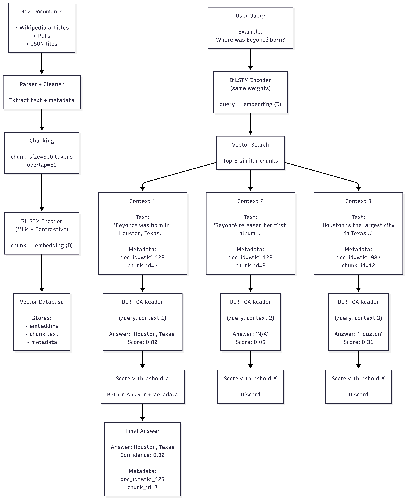

# NLP_Project
Group 4

# Task

```
Project: LSTM-based Question Answering on News Articles

Goal. Build a news QA system that 
(1) ingests and cleans hundreds of news articles, 
(2) retrieves relevant passages with a BiLSTM retriever, and 
(3) extracts short answers with an LSTM + attention reader. The system must return an answer with citation (URL, headline, date) and say “not found” when unsure.

Dataset
• Training corpus: “100s of news articles.” You may crawl allowed sources.
• Validation/test: Hold out at least 10% of articles for evaluation.
• Queries: Use titles/first sentences/headlines to form training queries; for evaluation, use the
provided question set (see “Evaluation Questions” below) plus 10 student-written questions.

Deliverables (what to submit)
1. Code & README (how to run end-to-end; requirements; commands to retrain and index).
2. Models & index artifacts (retriever encoders, FAISS/ScaNN index, reader weights).
3. Demo script or notebook (takes a question → prints answer + confidence + top-3 citations).
4. System diagram (one page) of the pipeline.
5. Short report (≤6 pages) answering the Report Questions below, with figures/tables.
6. Error log (10 failed cases with brief analysis and screenshots or text traces).

Milestones & Minimum Requirements
1) Data ingestion & cleaning (Week 1)
• Crawl/ingest articles (store source, URL, date).
• Normalize text: remove boilerplate/ads/nav, fix Unicode; preserve paragraph boundaries.
• Chunk into 200–400-token passages with ~50-token overlap.
• De-duplicate near-identical passages (shingling/MinHash).
• Label metadata per passage: publisher, date, section, detected entities.
Checks: at least 5,000 passages; duplicates reduced by ≥10%.

2) Retriever (BiLSTM encoder) (Week 2)
• Inputs: word-piece embeddings (GloVe/fastText) ± optional char-CNN; concatenate positional +
date/recency features.
• Encoder: BiLSTM → pooling (mean/max or attentive) → fixed vector.

• Training data: build (query, positive, negative) triplets. Positives = passages from same article;
negatives = random + hard negatives from ANN.
• Loss: triplet / contrastive / InfoNCE.
• Index all passages with FAISS/ScaNN, store doc IDs for citation.
Checks: Retrieve top-k=20 for each query; report Recall@20 and MRR on validation.

3) Reader (Answer extractor with LSTM + attention) (Weeks 3)
• Extractive reader (required): BiLSTM + (bi)attention over passage conditioned on the question;
start/end span heads (softmax).
• Pretrain on SQuAD-style data (allowed) then distant supervision on your news (use spans when
the gold answer string appears).
• Loss: start/end cross-entropy.
Checks: Report EM/F1 on held-out evaluation questions.

4) Inference orchestration (Week 4)
• Preprocess question (tokens, entities, date hints).
• Retrieve top-k=20, then re-rank with a small BiLSTM cross-encoder (question ⊕ passage) to get
top-m=5.
• Run reader on top-m; aggregate candidate spans (pick highest score or merge consistent spans).
• Always print: answer + confidence + URL + headline + date.
• Fallbacks: if confidence < τ, output “not found” and show top sources. Prefer newer passages on
ties.

Top 10 Evaluation Questions (Samples)
1. Who is the CEO of Apple as reported in the latest article?
2. On what date did the 2024 Paris Olympics opening ceremony occur according to the article?
3. What fine did the European Commission impose on Google?
4. What was the reported death toll in the 2023 Morocco earthquake?
5. What was the closing share price mentioned for Tesla in the article?
6. Which university published the study on Alzheimer’s disease?
7. What variant was discussed in the COVID-19 health article?

8. What country mediated talks on the Russia–Ukraine conflict?
9. What merger value was cited in the Microsoft–Activision deal?
10. What data breach size (number of users) was reported in the Facebook leak?
```


## Experiments Performed:

1. Bert-style lstm training with 190 publicly available books (200k texts)
    - Tokens:
        - Total tokens: 88 Million tokens
        - In-vocab tokens: 85.5 Million tokens (tokens used for training)
        - OOV tokens: 2.4 Million tokens
        - Unique in-vocab: 30k tokens
        - Unique OOV: 236k tokens
    - 30000 vocab (word-based)
    - 15% masking
        - 80% replaced with [MASK]
        - 10% replaced with random tokens
        - 10% original token
    - task: predict the original token
    - Result:
        - === Epoch 1 finished | loss=4.6106 ppl=100.55 masked_acc=0.2911 ===
        - === Epoch 2 finished | loss=3.7401 ppl=42.10 masked_acc=0.3790 ===
        - === Epoch 3 finished | loss=3.4656 ppl=32.00 masked_acc=0.4072 ===
    - Files used:
        - data/contrastive_anchors_positives.json: 190 books data preped
        - bert_style_LSTM_MLM.py: trains bert based bi-LSTM
        - test_mlm_lstm.py: tests MASK unmasking for trained model
        - models/mlm_bilstm/*pt: contains trained model, voacb and model config

2. Bert-style lstm training with learned cbow embedding transfering
    - cbow:
        - Epoch 1 — loss: 5878969.00
        - Epoch 100 — loss: 225296.00
        - Tests: (word to word semantic score)
            - government ↔ nation = 0.3342
            - government ↔ book = -0.0273
            - government ↔ happiness = 0.0619
            - government ↔ machine = 0.1855
            - government ↔ citizen = 0.1097
            - government ↔ judiciary = 0.2022
            - government ↔ democracy = 0.2379
    - Result:
        - === Epoch 1 finished | loss=4.1486 ppl=63.35 masked_acc=0.3411 ===
        - === Epoch 2 finished | loss=3.4115 ppl=30.31 masked_acc=0.4117 ===
        - === Epoch 3 finished | loss=3.1945 ppl=24.40 masked_acc=0.4341 ===
    - Files:
        - data/contrastive_anchors_positives.json: 190 books data preped
        - word2vec_embed_transfer_learning.py: cbow training file (requires model.pt to pass voacb)
        - test_word2vec.py: tests word embedding for query with list of words
        - models/word2vec_cbow_mlmvocab.model: cbow model used for embedding transfer learning to bi-LSTM
        - pretrained_embed_matrix.py: code for creating embedding matrix using cbow trained model
        - bert_style_LSTM_MLM.py: trains MLM using cbow's trained embedding
        - models/mlm_bilstm_embed_100: MLM trained model using cbow's embedding state dict
        - test_mlm_lstm.py: tests MASK unmasking for trained model
___

Conclusion:
- Bert based mlm helps but constrained by training data and scaled compute
- Transfer learning of word based embedding helps to converge the MLM and semantic embedding faster but cannot beat the constraints.

___
3. Contrastive training on Hard Negative samples (ms_marco dataset):
    - using pre-trained bert based lstm model
    - Epoch 1:
        - train_loss=3.8534 | val_loss=3.5607
        - train_metrics: {'top1': 0.1824, 'mrr': 0.3203, 'r@5': 0.4835, 'r@10': 0.6183}
        - val_metrics:   {'top1': 0.2247, 'mrr': 0.3725, 'r@5': 0.5548, 'r@10': 0.6816}

    - Epoch 2:
        - train_loss=3.2217 | val_loss=3.2917
        - train_metrics: {'top1': 0.2453, 'mrr': 0.4036, 'r@5': 0.6054, 'r@10': 0.7410}
        - val_metrics: {'top1': 0.2526, 'mrr': 0.4078, 'r@5': 0.6045, 'r@10': 0.7293}

    - Epoch 3:
        - train_loss=2.9815 | val_loss=3.1643
        - train_metrics: {'top1': 0.2756, 'mrr': 0.4389, 'r@5': 0.6510, 'r@10': 0.7812}
        - val_metrics:   {'top1': 0.2708, 'mrr': 0.4274, 'r@5': 0.6277, 'r@10': 0.7500}
    - Epoch 10:
        - train_loss=2.3052 | val_loss=2.9662
        - train_metrics: {'top1': 0.3958, 'mrr': 0.5583, 'r@5': 0.7768, 'r@10': 0.8701}
        - val_metrics:   {'top1': 0.2961, 'mrr': 0.4569, 'r@5': 0.6684, 'r@10': 0.7812}

    - Semantic similarity Example:
        - Query: declaration of independence
            - 0.6168 | The unanimous Declaration of the thirteen united States of America
            - 0.2139 | This recipe uses eggs and flour
            - 0.0718 | Project Gutenberg released its first ebook in 1971
    - Files:
        - models/mlm_bilstm_embed_100: MLM trained model using cbow's embedding state dict
        - contrastive_embedding.py: training code for ms_marco dataset (embedding model training)
        - models/ms_marco_emb/train.log: training log for 10 epochs
        - models/ms_marco_emb/bilstm_best.pt: best training model embedding
        - test_semantic_capacity.py: tests query sentence with list of sentences for semantic similarity
___

Conclusion: Training on hard-negative mined dataset is essential rather then just random negatives (tried random negatives with 190 books first)

___

4. SQuAD v2 QA Training using Bi-LSTM:
    - using pre-trained Bi-LSTM embedding model (from Exp. 3)
    - Data conversion from chat based indexing to word based (our vocab)
         ```
            Curation summary (train):
            {
            "kept_answerable_ok": 86544, 
                "kept_with_unk": 31706, Answerable with unknown
                "filtered_answerable": 277, span alignment issues
            "kept_unanswerable": 43498, No answer
            "total_examples": 130319, 86k + 43k = ~130k
            "kept_examples": 130042,
            "filtered_examples": 277
            }
            Curation summary (validation):
            {
            "kept_answerable_ok": 5917,
                "kept_with_unk": 2257,
                "kept_unanswerable": 5945,
            "filtered_answerable": 11,
            "total_examples": 11873,
            "kept_examples": 11862,
            "filtered_examples": 11
            }
        ```
    - Epoch 1 | Avg Loss=6.7316 | LR=2e-05
        ```
        Overall: EM=48.39, F1=48.83
        Has-Answer: EM=1.08, F1=1.97 (n=5915)
        No-Answer: Acc=95.44% (n=5947)
        Predictions: 11204/11862 no-answer (94.5%)
        ```
    - Epoch 2 | Avg Loss=5.6426 | LR=2e-05
        ```
        Overall: EM=45.10, F1=46.65
        Has-Answer: EM=5.22, F1=8.34 (n=5915)
        No-Answer: Acc=84.77% (n=5947)
        Predictions: 9491/11862 no-answer (80.0%)
        ```
    - Epoch 20 | Avg Loss=2.0097 | LR=2e-05
        ```
        Overall: EM=38.49, F1=43.70
        Has-Answer: EM=21.89, F1=32.34 (n=5915)
        No-Answer: Acc=55.00% (n=5947)
        Predictions: 5296/11862 no-answer (44.6%)
        ```

QA Architecture:

